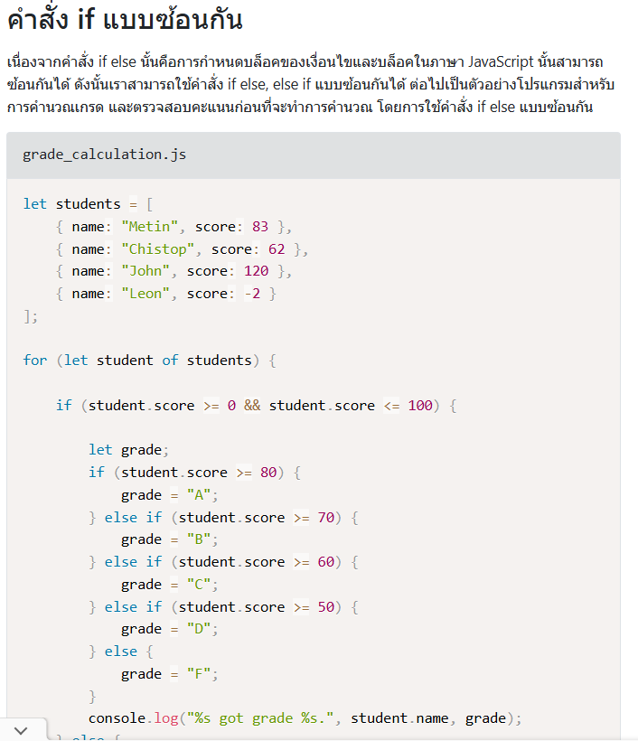

# JavaScript Assessment: Find Your Hat

[Codecademy](https://www.codecademy.com/projects/practice/find-your-hat)

## Table of Contents

- [JavaScript Assessment: Find Your Hat](#javascript-assessment-find-your-hat)
  - [Table of Contents](#table-of-contents)
  - [Repo Instructions](#repo-instructions)
  - [Project Goals](#project-goals)
  - [Project Requirements](#project-requirements)
    - [Game Rules:](#game-rules)
  - [JavaScript Assessment Rubric](#javascript-assessment-rubric)
    - [Thinking Process](#thinking-process)

---

## Repo Instructions

1. Clone the assessment repository, open it in your working directory, commit your progress accordingly, and push the repository to share it with the instructors.
2. Read the instructions in the `README.md` file.
3. Start the project:

   ```terminal
   npm install
   npm run dev
   ```

4. Edit `package.json` file by updating the `"author"` field with your Zoom name.
5. Edit **Thinking Process** section at the end of the `README.md` file. 👉 [Go to Thinking Process](#thinking-process)

[🔝 Back to Table of Contents](#table-of-contents)

---

## Project Goals

- In this project, you’ll be building an interactive terminal game.
- The scenario is that the player has lost their hat in a field full of holes, and they must navigate back to it without falling down one of the holes or stepping outside of the field.

[🔝 Back to Table of Contents](#table-of-contents)

## Project Requirements

- Your project is centered on a `Field` class.
- Give your `Field` class a `.print()` method that prints the current state of the field.

  > The Field constructor should take a two-dimensional array representing the “field” itself.
  >
  > A field consists of a grid containing “holes” (O) and one “hat” (^).
  >
  > We use a neutral background character (░) to indicate the rest of the field itself.
  >
  > The player will begin in the upper-left of the field, and the player’s path is represented by \*.

  ```js
  const myField = new Field([
  	["*", "░", "O"],
  	["░", "O", "░"],
  	["░", "^", "░"],
  ]);

  // Output:
  *░O
  ░O░
  ░^░

  ```

- Your game should be playable by users. In order to facilitate this, build out the following behavior:

  - When a user runs `main.js`, they should be prompted for input and be able to indicate which direction they’d like to `move`.
  - After entering an instruction, the user should see a printed result of their current field map with the tiles they have visited marked with the player's path. They should be prompted for their next move.

[🔝 Back to Table of Contents](#table-of-contents)

### Game Rules:

**1. Wins by finding their hat.**

**2. Loses by landing on (and falling in) a hole.**

**3. Loses by attempting to move “outside” the field.**

**When any of the above occur, let the user know and end the game.**

[🔝 Back to Table of Contents](#table-of-contents)

---

## JavaScript Assessment Rubric

1. Class Method ที่ควรมีครบ: (2 pts ครบถ้วน | 1 pts มีไม่ครบ | 0 pts ไม่มีเลย)

- constructor
- moveRight
- moveLeft
- moveUp
- moveDown

2. Print Map (2 pts ครบถ้วน | 1 pts มีไม่ครบ | 0 pts ไม่มีเลย)

3. เดินได้ถูกต้อง & Update Map ได้ถูกต้อง (2 pts ครบถ้วน | 1 pts มีไม่ครบ | 0 pts ไม่มีเลย)

- เลี้ยวซ้าย
- เลี้ยวขวา
- ขึ้น
- ลง

4. Game Logic: (2 pts ครบถ้วน | 1 pts มีไม่ครบ | 0 pts ไม่มีเลย)

- Wins by finding their hat
- Loses by landing on (and falling in) a hole.
- Attempts to move "outside" the field. (Warning message when actor attempts to move outside)

5. มี Random ตำแหน่ง: (2 pts ครบถ้วน | 1 pts มีไม่ครบ | 0 pts ไม่มีเลย)

- holes
- hat
- actor

6. Thinking process & Breakdown the steps of a thinking process (5 pts ครบถ้วน | 3 pts มีไม่ครบ | 0 pts ไม่มีเลย)

[🔝 Back to Table of Contents](#table-of-contents)

---

**Please Write Down Your Thinking Process Below:**

---

### Thinking Process

1.  step 1
เต้ย เข้าไปดูใน Codeacademy แล้วไปนั่งงมจนทนไม่ได้เลยเปิดหา tutorial ในยูทูป ดูแล้วทำตาม มานั่งคิดๆแล้วโยนโค้ดให้ ai ช่วยอธิบาย แต่ล่ะบรรทัด ครับแล้วเอามาโมดิฟายเอง 
2. step 2
เต้ยลองจะทำ Math.random แล้วแต่ว่ายังงงๆในเรื่องของ logic ก็เลยไม่ได้ทำนะครับ
3. step 3
ตอนนี้ที่เป็นกังวล คือเรื่องของlogic อย่างเช่น if else ! เต้ยก็ได้กลับไปทำความเข้าใจใหม่ ทั้งคืน เพื่อจะได้เขียน Handle movement รู้เรื่อง และก็เรื่องของลูปด้วย
4.  step n
สุดท้ายนี้เต้ยขอสารภาพ ว่าเต้ยเจอนิสัยใหม่ของตัวเอง ก็ตอนที่เต้ยไม่รู้แล้ว พยายามทำให้ได้ เหมือนสันหาวิธีทำ  คือนั่งคิดทั้งคืน โค้ดไม่ดีมากแต่ถ้ามาถามเต้ยตอนนี้ก็มั่นใจแล้วจะสามารถอธิบายได้ นิดหน่อย ขอบคุณครับ
_Notes:_<br>
_- You can attach flowcharts, diagrams, and images as needed._<br>
_- The purpose of this section is not to explain your code but rather to convey your thoughts and ideas._

[🔝 Back to Table of Contents](#table-of-contents)
